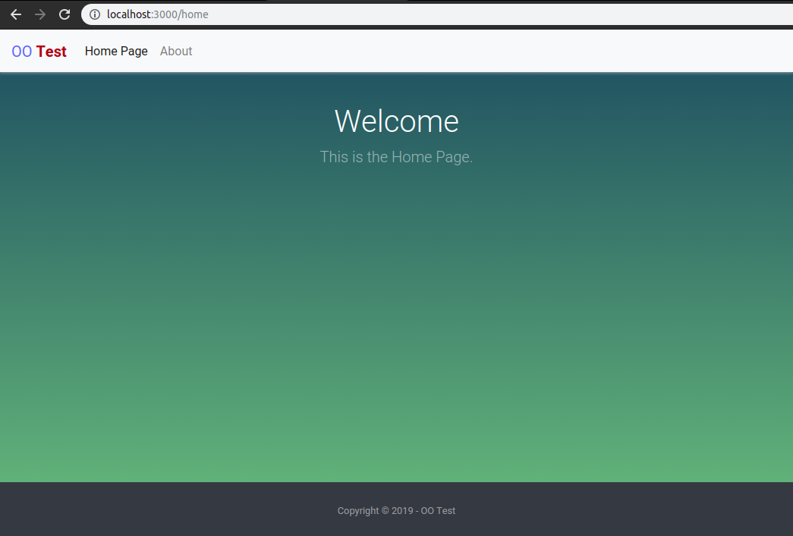

# Sistema de Template em PHP

## Como assim?

Um sistema de template é uma forma legal de gerenciar o front-end em projetos de pequeno porte utilizando o PHP puro, visto que frameworks de mercado já possuem uma ferramenta para tal (melhor e mais fácil).

Com esse sistema eu posso separar meus arquivos (front-end e back-end) em pastas diferentes sem ter de me preocupar com o caminho relativo desses arquivos.

## Como é por baixo dos panos?

Na prática, o site vai carregar a página index.php. Dessa forma, o caminho dos arquivos será relativo ao diretório root (onde o index.php está localizado).

A classe URL, que é instanciada no index, tem o papel de ler a URL da página e mostrar o conteúdo adequado. Caso a página solicitada na URL não exista, o usuário é redirecionado para a página 404.

Antes de mostrar a página, a classe URL busca no arquivo "pages.json" e carrega os dados da página, como título, linguagem, estilos, dentre outros. Caso a página não exista nesse arquivo, é retornado o erro 404.

## O que falta fazer?

1. Implementar Rotas.
1. Mecanismo de Url amigável.
1. Criar tags customizadas para substituir ```<?php ?>```

## Printscreen

